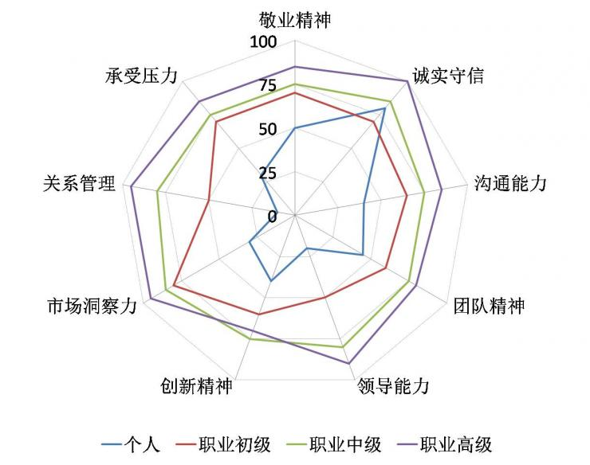

Career (职业生涯)
===================

胜任力是人力资源的基础，牵涉到几乎所有的模块。

个人职业生涯规划中的胜任力研究，实际是个人对自我能力和职业能力认知结合的过程。也就是首先要知道自己已经具备和可能具备什么样的能力；其次要知道某一个职业需要什么样的能力。通过两个方面的比较来判断，自己是否具备在从事该职业的可能性。

以下仅从如何比较个人胜任力与职业胜任力略作说明。

一、选取胜任力工具

现在胜任力模型五花八门，最有名的是合益的胜任素质模型，不过，各个公司的胜任力模型原理上大同小异，由于胜任力模型在个人职业生涯规划中只是一个参考作用，为了方便评价，建议个人选择一套对评价方法描述更为详细的标准为好。

二、个人能力评价

对自我能力评价，最好能够结合个人自评、同学或朋友评价、人力资源专家评价三方的意见。其中：人力资源专家的评价一般是建立在访谈和专业测试工具的基础上，所以更具说服力。朋友和个人意见是对人力资源专家意见的补充和调整。

三、职业能力评价

一般完整的胜任力工具包括了各职业及某职业中不同级别的胜任力标准。如果没有相应标准，可由该职业工作人员和人力资源专家帮助完成该项标准的评定。确要明确的是，为了确保评价的客观性，应该同时由该职业工作人员和人力资源专家为该职业的不同级别和测试个人评分。

四、两项评价完成后，可以得出以下雷达图。

从图中，可以很直观地发现，个人与职业要求相匹配的能力差距有多大。一般来说，单项指标的能力差距越大，则该指标越应该引起重视。

五、分析

重点分析能力差距较大的指标。例如本例中关系管理能力，个人与该职业初级差距在40分左右；与中级差距在70分左右，与高级差距在80分左右。

通过对关系管理能力的了解，我们知道关系管理包括客户数据管理和分析、渠道管理等专业内容，这就可以从个人性格上来看看这些知识或能力是否个人喜欢或能够通过学习和实践得到提高的。一旦出现个人喜欢或通过学习和实践提高有限的因素，则应该对该职业的选择序位向后排。

六、根据以上的比较，我们可以很轻松地找到更加贴合自己要求的职业。并按照职业设计自己未来发展规划。

（本文中的胜任力模型摘自网络上和邦胜任力模型资料，仅供参考。）
